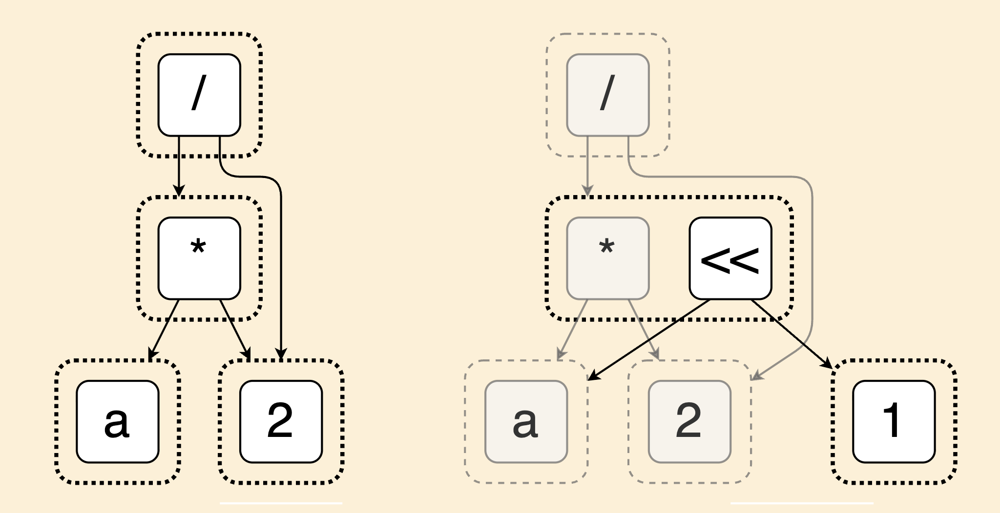
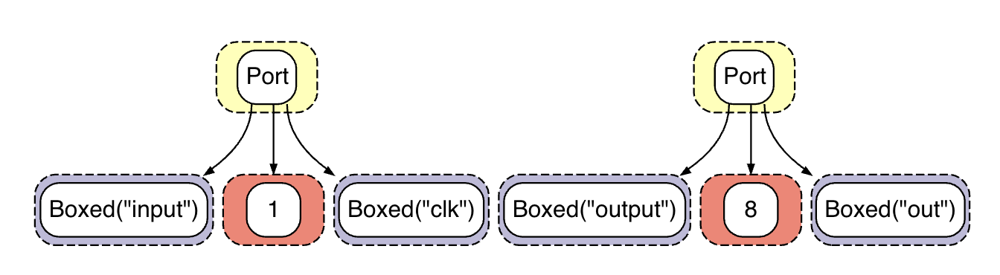
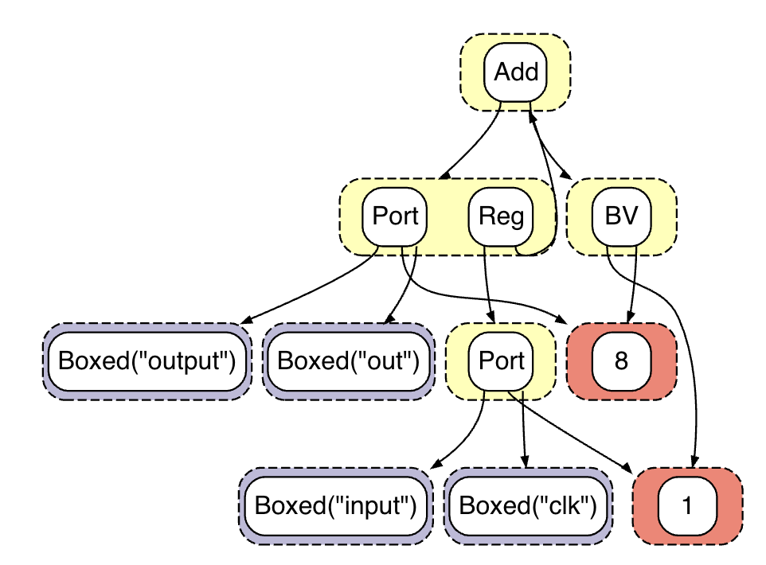
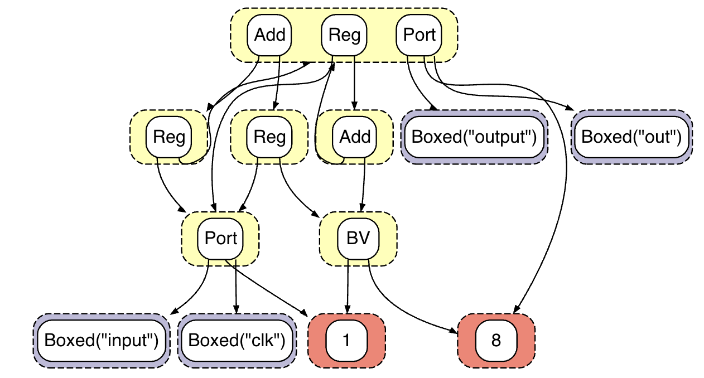

## Quickstart

These commands should work on Mac and most Linux distributions. Dependencies:

* Rust (install via `rustup`)
* Python3 + venv

```
# Clone this repo.
git clone --recursive https://github.com/gussmith23/2025-orconf-demo
cd 2025-orconf-demo

# Create and activate a Python virtual environment.
python -m venv .venv
source .venv/bin/activate
pip install -r requirements.txt

# Clone and build Yosys.
# You may use a prebuilt Yosys, but Yosys's plugin system works most easily when you build from source.
git clone --recursive https://github.com/YosysHQ/yosys
cd yosys
make PREFIX=$PWD/install -j`nproc` install
export PATH="$PWD/install/bin:$PATH"

# Make Yosys plugins.
# The Yosys+egglog plugin itself:
make -C yosys-plugin
# The Churchroad (https://github.com/gussmith23/churchroad) plugin, which we use for its egglog hardware DSL.
make -C churchroad/yosys-plugin

# Finally, run the example!
./examples/simple/run.sh
```

# Yosys + egglog: Supercharge your passes with Equality Saturation

This is a demo written for OrConf 2025 in Valencia, Spain.

**Abstract:** Equality saturation (eqsat) is a neat new technology for building compilers and EDA tools.
It's seen a lot of adoption in EDA, but can still be inaccessible to the average designer.
We present a Yosys plugin that lowers the barrier to entry for using eqsat.

<!-- **Background:** at this year's Latch-Up conference in Santa Barbara, I spoke with a group of people about equality saturation (eqsat) during the un-conference.
This made me realize I could make an easy on-ramp to using eqsat with hardware via a Yosys pass.
This demo presents a (very rough) version of that pass!

**Goal:** give people an easy way to play with equality saturation for hardware via Yosys. If you already have a Yosys flow, this should* just work! -->

Note that this prototype will definitely break, but we will be actively working on this, so please submit issues as you find them.

## What is Equality Saturation? 

Equality saturation is a program optimization/transformation technique that's becoming increasingly popular in hardware design/EDA workflows. See some example papers:

* [Equality Saturation for Circuit Synthesis and Verification (Sam Coward's thesis)](https://samuelcoward.co.uk/assets/pdf/Thesis_Imperial.pdf)
* [ESFO: Equality Saturation for FIRRTL Optimization](https://dl.acm.org/doi/abs/10.1145/3583781.3590239)
* [Scaling Program Synthesis Based Technology Mapping with Equality Saturation](https://arxiv.org/abs/2411.11036)
* [Equality Saturation for Datapath Synthesis: A Pathway to Pareto Optimality](https://ieeexplore.ieee.org/abstract/document/10247948)

Anecdotally, I have heard of major EDA vendors also beginning to use eqsat in their tools.

At the core of eqsat is the **egraph** datastructure: essentially, an efficient database for storing programs.

The egraph on the left transforms into the egraph on the right when we transform the multiplication by two into a left shift by one:



As you can see, the multiplication and left shift nodes are now in the same "equivalence class" or *eclass*.
This overlapping of multiple expressions into the same eclass leads to significant sharing across the entire database.
This allows us to store many, many equivalent versions of a program/hardware design efficiently.


## What is egglog?

[egglog](https://github.com/egraphs-good/egglog) is an equality saturation implementation.
It provides a simple input language and a powerful underlying database.
It is quite easy to pick up and use.


[Here is a very simple example of inserting a hardware design into the database and transforming it via a rewrite.](https://egraphs-good.github.io/egglog-demo/?program=XQAAgABSAwAAAAAAAAAUHMnnVi1HmurH0_ncX6dnJVwUBmLVa-mxsg6huddnznArUb1o0sC53b1M8A15UyGzSL6rtLOzi2TkaPRlDeewaJsKHTkwE0DqtdgV6HGTGjosR-_BuUG70ZqyGQwXMLXwCld7APmlV1wbX-tXEEy55f5rSzhDXeRWrEe_QBO5O_v43XQDj8Vmlr3GdACtY5v-xr1SSR2rvomh4OdYRCYBHAbqZCXoD0qN7bnrjkCdErKtjvkQYOphajZfpDRsADmALXrg8RaFx0aTZrFOlvqw-9GCW5fuMbZ9xoqrPxcNJjCdGZPaarMpUAkDvrb8BSjrfc97TjY4GPsyBJL1nHescWX8c7DWmuCfpD3NppZcybX3nERxsttI5THG3WcW-ig624zs3T6zfSdvddhDnt2429187QHWWWpPIzE4w2kSv8zEGoJBI9gdv_hxv5eXMIgHC2KUk7raXcbf8hnYAIIBQv1JBM3RsNwPV2Ju3i1qvlhSIrvF-0xI_458re4%253D)


We'll go through the code line by line.

The design we're working with is this simple counter:

```sv
module counter(input clk, output [7:0] out);
  logic [7:0] counter_val = 0;
  always @ (posedge clk) counter_val <= out + 1;
  assign out = counter_val;
endmodule
```

First, we will insert the design into the database. **Note that our Yosys+egglog plugin handles this heavy lifting for you---we are simply walking through this example for educational purposes.**

To insert the design in the database, we first need a small hardware design language, defined by these lines:

```
(sort Expr)
(constructor Add (Expr Expr) Expr)
(constructor Reg (Expr Expr) Expr)
(constructor BV (i64 i64) Expr)
(constructor Port (String i64 String) Expr)
```

Our simple language only has adders, registers, bitvector constants, and ports.
The Yosys+egglog plugin uses a much richer underlying language, capturing more features of HDLs.

Next, we define our ports:

```
(let out (Port "output" 8 "out"))
(let clk (Port "input" 1 "clk"))
```

When you run these lines, you'll see that the ports appear in the database on the bottom right:



Next, we add our adder and register:

```
(let counter-val (Reg clk (Add out (BV 1 8))))
```

Again, these new expressions also appear in the database.

Finally, we need to connect our `out` port to the output of the register.
In Verilog, this is done using a *continuous assignment:*

```sv
assign out = counter_val;
```

Semantically, continuous assignments quite literally say "the thing on the right hand side is ALWAYS EQUAL to the thing on the left hand side"; hence, "continous". 
Thus, the left and right hand side are *equivalent.*
Equivalence is a first-class concept in egglog;
  to mark that `out` and `counter-val` are equivalent, we use the `union` command:

```
(union out counter-val)
```


Unioning `out` and `counter-val` puts them in the same *eclass* or *equivalence class,* just like the multiplication and left shift nodes in the image above:




Great! at this point we have the design in the egraph.

**But how would I use this as a designer?**

Everything shown above---getting the design into the database---is handled automatically by the Yosys+egglog plugin. 
Now let's take a look at the kind of egglog code a hardware designer might write.

Imagine we want to do a transformation over the hardware design---for example, retiming.
Expressing such a transformation is easy using *rewrites* in egglog:

```
(rewrite 
 (Reg clk (Add e1 e2))
 (Add (Reg clk e1) (Reg clk e2)))
```

This rewrite searches for pattern in the first argument, and inserts the pattern in the second argument.
In this case, the rewrite states that, when you see an adder with a register on its output, you can push the register into the inputs.
This may or may not be useful in your usecase, but you can imagine other transformations relevant to your usecases (e.g. logic simplification, techmapping, translation between platforms...)

Running the rewrite for one iteration (with `(run 1)`) produces the following database:



Now our top-level eclass has yet another expression in it, the `Add` node, representing the retimed expression.

Now that we have an interesting database capturing multiple possible versions of our design, we need to extract out a transformed version of the design.
This is known as **extraction**.
This step is not shown in this simple example, but is discussed later in this demo.


## Yosys + egglog

With that background, we are now ready to look at the egglog plugin for Yosys.

Interfacing with the plugin is quite simple:

```sh
yosys \
  -m "./yosys-plugin/churchroad.so" \
  -m "./yosys-plugin/eqsat.so" -p "

    read_verilog -sv <your design files>
    hierarchy
    proc
    ...other passes...
    eqsat --egglog-script <path to rewriting script> --extract-script <path to extraction script>
    ...other passes...
    write_verilog

"
```

The `eqsat` pass does the following:

1. Converts your design into an egglog hardware DSL (the process we did manually above)
2. Runs the user-specified `--egglog-script`s, if any. This is where the user can specify the rewrites they would like to run.
3. Runs the user-specified `--extract-script`, to extract the final representative from the design. If no extraction script is specified, runs a naive extraction (currently a random extraction for demo purposes).

This architecture is meant to be maximally flexible.
Notably, you can write your extraction in Python, meaning you can use any Python libraries you'd like to implement a simple or complex extraction procedure.
As long as you imitate the Python interface in our demo extraction scripts, the extraction will work with the pass.


## Going Forward

We are working on a number of improvements:

* A richer and more efficient underlying egglog DSL 
* More powerful extraction techniques
* Modifications to egglog core, to help it scale to real designs

Please submit issues for feedback, bug reports, and feature requests!

